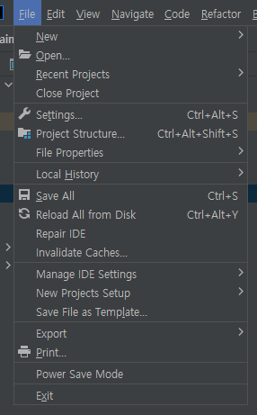
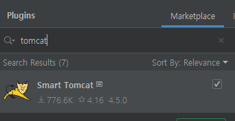
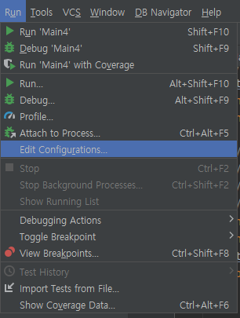
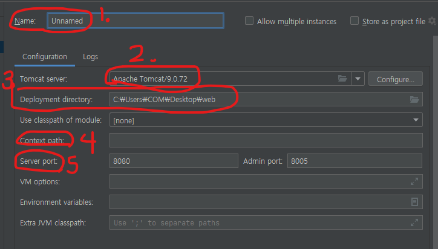

# 인텔리제이 커뮤니티 버전 톰캣 연동

### 1. 원하는 버전의 톰캣을 설치한다.

  https://tomcat.apache.org/

### 2. Smart Tomcat 설치

  - (windows) settings
  - (MacOS) preference

### 3. Tomcat 플러그인과 인텔리제이 연동 설정

- 1. 서버 이름 설정(원하는 이름을 설정하면 된다.)

- 2. Tomcat Server 설치경로 등록

- 3. deployment directory : Tomcat이 웹 어플리케이션을 배포하는데 사용하는 디렉토리 설정

web project인 경우 src/main 안에 있는 webapp 폴더를 선택 (배포를 위해)

maven이나 gradle을 사용하는 경우 프로젝트 루트 폴더를 선택

- 4. Context Path : Context Url 설정

- 5. Port 설정
                      

